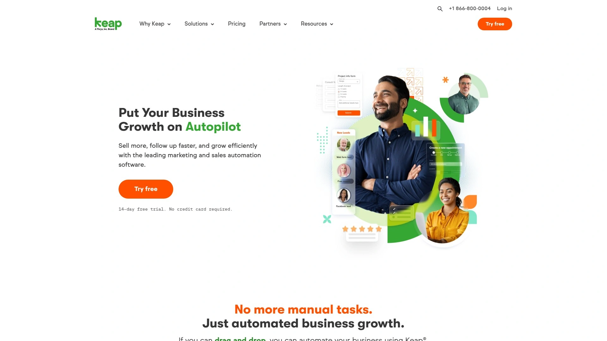
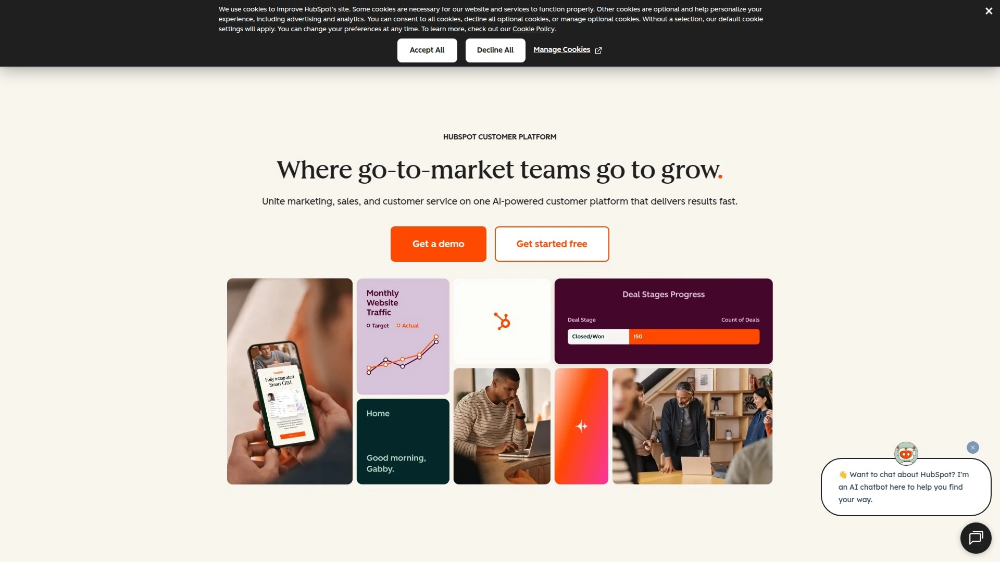
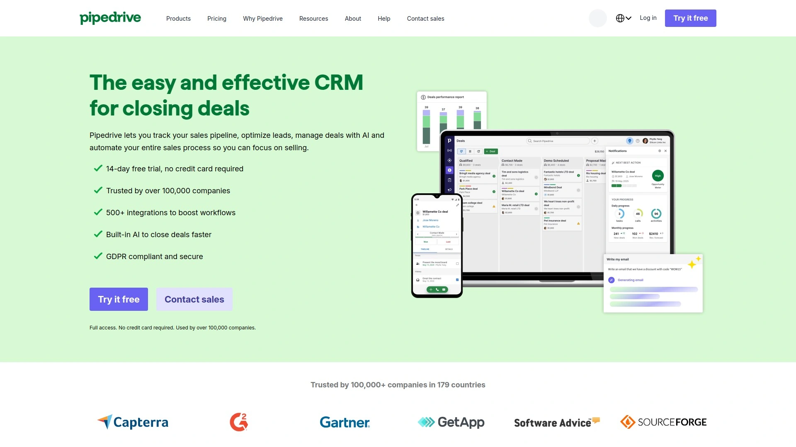

# Top 25 Small Business CRM & Automation Tools Ranked in 2025 (Latest Compilation)

**Struggling with scattered contacts and endless manual follow-ups?** Small business owners often juggle spreadsheets, emails, and customer notes across multiple apps – a recipe for *missed leads and constant chaos*. The good news is a **small business CRM** with **marketing automation** can put your customer management on autopilot. The following are the top solutions in 2025 that help you organize contacts, automate sales and marketing tasks, and ultimately save time while boosting sales. Each platform below promises to streamline your workflow, improve follow-up speed, and scale your business growth without the headache.

## [Keap](https://keap.com)
*All-in-one CRM and automation built for small business growth.*

**Keap** (formerly Infusionsoft) combines **CRM, marketing automation, and e-commerce** in one package designed for entrepreneurs. It’s trusted by over 200,000 small businesses for organizing leads and automating daily tasks. If you’re tired of manually following up with prospects, Keap’s visual campaign builder lets you drag-and-drop to create automated workflows for email follow-ups, appointment reminders, and even invoice payments. It offers built-in templates for common campaigns (like welcome sequences or lead nurturing), so you can get started quickly without coding. Small teams appreciate Keap’s **all-in-one approach** – you get contact management, email marketing, sales pipeline, and even a dedicated business phone line in one app. While Keap isn’t the cheapest option, it **shines for service-based businesses** that need robust automation to avoid things slipping through the cracks. With a 14-day free trial and hands-on onboarding support, Keap makes it easier to ditch the chaos of spreadsheets and scale up efficiently.

## [ActiveCampaign](https://www.activecampaign.com)
*Automation powerhouse with built-in CRM for savvy marketers.*

**ActiveCampaign** is renowned for its **powerful email marketing and automation** capabilities, paired with a lightweight CRM for sales tracking. This platform is ideal for teams who want to craft **sophisticated, behavior-driven customer journeys**. You can build automation workflows that react to customer actions – for example, sending a follow-up offer if a user clicks a specific link or segmenting your list when a purchase is made. ActiveCampaign’s automation builder is extremely flexible, allowing triggers across email, SMS, site visits, and more. It also integrates with over 850 apps (Shopify, WordPress, Facebook, etc.), ensuring your marketing stack is well connected. On the CRM side, ActiveCampaign lets you manage deals and track pipelines, though its sales features are simpler compared to dedicated CRMs. Keep in mind the **learning curve**: because of its rich features, it may take some time for beginners to master all the automation options. However, for **marketing-focused small businesses** that want advanced workflow customization without enterprise costs, ActiveCampaign provides tremendous value. Pricing starts affordable and scales with your contact list, and there’s a free migration service to help switch from another tool.

## [HubSpot](https://hubspot.com)
*Full-suite CRM platform with free tools and room to grow.*

**HubSpot** is a heavyweight in the CRM world, offering a broad suite of tools for **marketing, sales, and customer service**. For small businesses, HubSpot’s big appeal is its **free CRM** – unlimited contacts, with core features like contact management, deal tracking, and basic email marketing at no cost. On top of that, HubSpot’s paid “Hubs” add powerful capabilities: the Marketing Hub for email campaigns and lead capture, Sales Hub for advanced CRM features and automation, and so on. The interface is very polished and beginner-friendly; you can easily see each contact’s interaction history (emails, calls, website visits) on a timeline, which helps a ton during sales calls. HubSpot also has a rich marketplace of integrations and an Academy with free courses to get you up to speed. The platform is **highly scalable** – as your business grows, you can upgrade plans to unlock sophisticated automation, segmentation, and analytics. The main caveat is cost: the free tools are great to start, but HubSpot’s paid tiers get pricey fast, especially at scale. That said, for a company looking to invest in a long-term CRM solution with enterprise-grade features (and willing to pay for it down the road), HubSpot is often the go-to choice. It’s a “grow with you” platform where you can start free and gradually access more advanced automation as needed.

## [Zoho CRM](https://www.zoho.com/crm/)
*Budget-friendly CRM as part of an all-in-one business software suite.*

**Zoho CRM** attracts **budget-conscious businesses** by delivering a solid set of CRM and basic marketing automation features at an affordable price (and even a free tier for small teams). Part of the 45+ apps in the Zoho ecosystem, this CRM seamlessly connects with Zoho’s email marketing, accounting, support, and other tools – a big plus if you’re already using Zoho products. In Zoho CRM, you can manage leads, deals, and tasks with customizable pipelines and workflow rules. Its automation is sufficient for things like sending follow-up emails or updating fields when a deal moves stages, though it’s not as advanced in AI or complexity as some higher-end tools. The strength of Zoho CRM is **flexibility**: you can tailor modules, fields, and even create custom automation blueprints to match your business process. It also offers Zia, an AI assistant that can predict lead scores or suggest when to contact leads, adding a modern touch. Zoho’s pricing is notably lower than many competitors, and you can mix-and-match apps (CRM, campaigns, desk, etc.) or opt for Zoho One for an all-inclusive bundle. This makes Zoho an excellent choice for small businesses that need a **CRM foundation with broad functionality** without breaking the bank. Just be prepared for a modest learning curve as you explore all the customization options.

## [Pipedrive](https://www.pipedrive.com)
*Visual sales pipeline CRM to manage deals and follow-ups with ease.*

**Pipedrive** is a popular choice for small businesses that are **focused on sales pipelines** and deal management. True to its name, Pipedrive provides a clean, visual pipeline interface where you drag-and-drop deals through stages (e.g., Prospect > Contacted > Proposal > Won). This intuitive design helps sales teams clearly see their progress and prioritize hot opportunities. Pipedrive also includes handy automation for sales: you can set it to automatically send an email when a deal is moved to a new stage or create follow-up activities when a deal sits idle. It’s not as heavy on marketing automation, but it does integrate with email providers and has an add-on for email campaigns if needed. What users love is the **simplicity and user-friendliness** – reps can get up and running quickly, and the mobile app is great for updating deals on the go. Pipedrive has a built-in AI sales assistant that gives suggestions (like which deals to focus on) and can even automate data entry tasks. There’s no free plan, but pricing is reasonable and based per user per month. If your priority is to **manage a sales team and pipeline** rather than run complex marketing journeys, Pipedrive is a top contender that keeps things straightforward and effective.

## [Mailchimp](https://mailchimp.com)
*Easy email marketing platform with basic CRM for starters.*

**Mailchimp** earned its fame as an email newsletter tool, and it remains the go-to for many small businesses starting out with email marketing. Over time, Mailchimp has evolved to include a **basic CRM layer and automation** features, making it a simple all-in-one marketing platform for beginners. You can store your customer contacts, segment them into groups, and send targeted email or SMS campaigns with its drag-and-drop editor. Mailchimp’s automation is beginner-friendly – you can set up things like welcome email series, birthday messages, or follow-ups after a purchase with a few clicks. There’s also a generous **free plan** (up to 500 contacts) which is a big reason many new businesses flock to Mailchimp. The templates and guidance make it easy for non-marketers to create professional-looking emails. However, as your list grows or you need more advanced automation logic, Mailchimp can feel limited (and pricing increases notably for larger audiences). It also lacks robust sales pipeline tools – it’s more of a marketing-centric system. In short, Mailchimp is **best for small outfits just dipping their toes into CRM and email automation**: it covers the basics extremely well and helps you learn the ropes of customer engagement. As you scale, you might eventually outgrow it, but it’s an excellent starting platform with a very low barrier to entry.

## [GetResponse](https://www.getresponse.com)
*All-in-one marketing platform tailored for emails, funnels, and e-commerce.*

**GetResponse** is another veteran in the email marketing space that has expanded into a **full marketing automation suite**, especially attractive for online businesses. Along with the core email marketing (newsletters, autoresponders, etc.), GetResponse offers features like **landing page builders, webinar hosting, and sales funnel tools**. This makes it great for e-commerce and digital product sellers who want to capture leads and nurture them through to purchase – you can build entire conversion funnels right inside GetResponse. The platform’s automation capabilities are quite powerful: you can create workflows that tag customers based on behavior, send cart abandonment emails, recommend products, and more. In fact, GetResponse leans into e-commerce by providing integrations with Shopify, WooCommerce, Magento and even an AI product recommendation engine. They also recently introduced AI-driven tools (like an AI Email Generator and Subject Line generator using GPT technology) to help marketers create content faster. For CRM needs, GetResponse has a basic contact management and scoring system, but it’s not a full sales pipeline tool. Instead, it’s **best for marketing teams or solo entrepreneurs who primarily sell online** and need an all-in-one marketing hub. You’ll find that its interface is a bit more complex than Mailchimp, but that’s the trade-off for far richer functionality. Pricing is reasonable and includes a **30-day free trial** to kick the tires.

## [Brevo (Sendinblue)](https://www.brevo.com)
*Multi-channel marketing automation with a unique contact pricing model.*

**Brevo**, formerly known as Sendinblue, is a robust marketing platform that stands out by offering **email, SMS, and live chat** all in one place. If you want to engage customers through multiple channels without juggling separate tools, Brevo is an excellent choice. Its automation builder is user-friendly, allowing you to create workflows that might, for example, send an SMS follow-up if an email isn’t opened, or assign a new lead to a sales rep when a contact fills out a form. One of Brevo’s big differentiators is its **pricing model**: unlike most email tools that charge by number of contacts, Brevo’s plans are based on the number of emails you send per month (contacts are unlimited). This can be very cost-effective if you have a large list but only email segments of it regularly. Brevo also offers a built-in CRM module where you can manage contacts and sales tasks – it’s simpler than dedicated CRMs, but handy for a small team. They even added a basic sales pipeline feature, so you can visualize deals to some extent. The platform’s free tier allows up to 300 emails per day, which is great for startups. Overall, Brevo is **ideal for small businesses that want affordable multi-channel marketing** – you can do email newsletters, automated drips, two-way SMS campaigns, and chat, all from a single dashboard. It may not have the most advanced analytics or AI features, but it covers a lot of ground for the price.

## [Ontraport](https://ontraport.com)
*Comprehensive CRM and marketing automation, geared towards service businesses.*

**Ontraport** is an all-in-one platform often compared to Keap, as both originated in the world of small business automation. With Ontraport, you get a **full CRM for contacts and deals, plus a powerful marketing automation system** to design customer journeys. It’s particularly popular among service-based businesses, coaches, and membership-based companies – thanks to features like built-in membership site management and payment processing. Ontraport uses a visual campaign builder similar to Keap’s, where you can map out every step (emails, SMS, tasks, etc.) in your funnel. Its strength lies in how customizable and **structured** the automation can be; you can create very personalized paths depending on user behavior or attributes. Additionally, Ontraport provides performance dashboards and KPI tracking to monitor how your campaigns and sales are doing in real time. Be aware that with great power comes some complexity: new users might find Ontraport’s setup a bit intimidating at first, especially if you’re not tech-savvy. It’s also a premium product – starting price is higher than many simple tools (though it packs a lot into that cost). For a growing business that demands an **integrated solution for sales, marketing, and online transactions**, Ontraport is a rock-solid option that can scale, but it’s best suited for those willing to invest time in configuring a system tailored to their workflow.

## [EngageBay](https://www.engagebay.com)
*Affordable all-in-one CRM with marketing, sales, and support features.*

**EngageBay** markets itself as a budget-friendly alternative to the big all-in-one platforms like HubSpot. It offers modules for **Marketing Automation, CRM & Sales, and even a Helpdesk**, all tightly integrated (and you can opt for the All-in-One bundle to get everything). For a small business with limited budget, EngageBay delivers a lot: you can run email marketing campaigns, set up marketing automation workflows, manage your sales pipeline, and provide customer support – all from one system. The marketing automation covers the basics like email sequences, autoresponders, landing pages, and lead scoring. Its CRM side lets you track deals, tasks, and appointments with a clear dashboard. One of EngageBay’s biggest draws is its **price point** – it’s significantly cheaper than many competitors, and they even have a free version (with 250 contacts and branded emails) to get started. Despite the low cost, EngageBay is fairly feature-rich; for instance, it supports social media posting, SMS marketing, and has a live chat widget you can install on your site. The trade-offs: the user interface isn’t as slick as premium tools, and some advanced functionalities (like complex automation branching or AI features) might be lacking. However, for **small businesses looking for a true all-in-one solution on a shoestring budget**, EngageBay is a compelling choice that covers a broad range of needs without needing multiple subscriptions.

## [Constant Contact](https://constantcontact.com)
*Reliable email marketing service with event and social marketing add-ons.*

**Constant Contact** is one of the longstanding names in email marketing, known for its ease of use and strong support, especially for non-profits and small orgs. While primarily an email marketing service, it has gradually added features that inch it closer to a CRM: contact management, basic segmentation, and some automation capabilities (like welcome emails or drip campaigns). Constant Contact shines if your focus is on **newsletters, event marketing, or simple e-commerce promotion**. They offer an event management tool to handle registrations (handy for webinars, fundraisers, etc.) and even a social media posting feature. The template editor is beginner-friendly, and they provide numerous industry-specific templates to get started. One unique aspect is their high-deliverability and compliance focus – your emails are less likely to end up in spam, which is crucial for consistent engagement. On the downside, Constant Contact’s automation is relatively **limited compared to modern platforms**; you won’t get extremely complex trigger workflows here. And if you need a sales pipeline or advanced CRM functionality, you’d have to integrate an external CRM. The pricing isn’t the cheapest (especially since there’s no free tier beyond a trial), but many small businesses appreciate the phone support and hands-on guidance Constant Contact provides. Overall, it’s a **solid choice for small businesses that mainly need robust email outreach** with a dash of automation and prefer having dependable customer support to guide them.

## [Drip](https://www.drip.com)
*E-commerce focused automation platform to drive online sales.*

**Drip** brands itself as an **e-commerce CRM and automation platform**, meaning it’s purpose-built to help online stores convert and retain customers. If you run an online shop (on Shopify, WooCommerce, etc.), Drip offers tailor-made workflows for cart abandonment, post-purchase follow-ups, and personalized product recommendations. Its strength is in **deep personalization** – Drip tracks customers’ browsing and purchase behavior, allowing you to segment shoppers by what they viewed or bought and then send highly relevant emails or SMS messages. Setting up an automated series (for example, a welcome series that offers a discount on the first purchase, or win-back campaigns for lapsed customers) is straightforward with their playbooks. Drip’s interface is modern and marketer-friendly, with a visual workflow builder and pre-built templates for common e-commerce scenarios. It also supports multi-channel touches like SMS and integrates with Facebook Custom Audiences for ad targeting. While it’s fantastic for online retailers, Drip is **narrower in scope** than many all-in-one CRM tools – it doesn’t have a sales pipeline module for B2B or a full customer support system, for instance. Pricing is based on your number of contacts and can climb as your list grows (but if those contacts are buying, it’s well worth the investment). In short, Drip is the **ideal choice for online stores** and direct-to-consumer brands that want advanced e-commerce marketing automation to maximize customer lifetime value.

## [ConvertKit](https://convertkit.com)
*Email automation platform built for creators, bloggers, and solo entrepreneurs.*

**ConvertKit** is a favorite among **content creators, bloggers, and small online business owners** who need to nurture an audience but don’t want the complexity of a full-blown CRM. It focuses heavily on email sequences and simple automation with an interface that’s clean and easy to grasp. ConvertKit’s hallmark is how it handles **subscriber tagging and segmentation**: instead of lists, you have one list and can tag people based on their actions or interests (like clicking a link about “photography tips” could tag them as interested in photography). This makes it easy to send highly targeted content to the right people. The automation builder in ConvertKit is straightforward; you can set up sequences triggered by events (e.g., someone fills a form, or purchases a product via your integrated store). It’s not as visually fancy as some others, but it covers typical needs for creators – like delivering a lead magnet, onboarding new subscribers, or launching an email course. ConvertKit also offers **landing pages and simple sign-up forms**, so you don’t need another tool for those. Recently, they added a feature for selling digital products and subscriptions, further aligning with creators’ needs. While ConvertKit lacks traditional CRM features like deal tracking, its goal isn’t that – it’s to help you build and monetize an email audience. There’s a free plan for up to 1,000 subscribers which is great to start. If you’re a **creator who values simplicity and excellent deliverability** over complex marketing gimmicks, ConvertKit is made for you.

## [Freshsales (Freshworks CRM)](https://www.freshworks.com/crm/)
*User-friendly CRM with AI features, part of the Freshworks customer engagement suite.*

**Freshsales** – part of the Freshworks product family – is a CRM that balances simplicity for small teams with some powerful features as you grow. Out of the box, Freshsales provides all the essentials: contact and account management, deal pipeline visualizations, and workflow automation for routine tasks (like sending emails or updating fields when a deal progresses). What’s notable is the built-in **AI assistant ( Freddy)** which can score leads, detect deal insights, and even recommend next best actions. This adds a layer of intelligence usually found in pricier enterprise CRMs. Freshsales also seamlessly integrates with Freshdesk (for customer support) and Freshmarketer (for marketing automation), so if you’re using the Freshworks ecosystem, it’s a smooth experience to connect sales, marketing, and support data together. You can even run basic email campaigns and automations within Freshsales, especially if you have the all-in-one **Freshsales Suite** version – it combines sales CRM and marketing capabilities in one. The interface is modern and easy to navigate, often praised by teams that find tools like Salesforce too overwhelming. There’s a free tier for up to 3 users, which is great for very small businesses. In terms of cost, Freshsales tends to be reasonably priced and scalable. It’s an excellent option for small-to-medium businesses that want a **full-featured CRM solution with some marketing chops** and appreciate having AI-driven insights to guide their sales process.

## [Nimble](https://nimble.com)
*Social CRM that unifies contacts and conversations across channels.*

**Nimble** is a unique player in this list – it calls itself a “social CRM” because it emphasizes building relationships and pulls in data from **social media, email, and more** into one unified contact record. If your business thrives on networking and staying engaged with clients across LinkedIn, Twitter, Facebook, plus traditional channels, Nimble can save you a lot of toggling around. It automatically enriches contact profiles with public social info, interaction history, and even recent social posts or news about the person/company. This context can be golden before a sales call or partnership meeting. Nimble’s dashboard will remind you whom to follow up with each day (based on rules or inactivity), acting like a personal assistant for relationship management. For marketing, you can send group messages that feel personal (mail merge style) and track who opens or clicks, helping you gauge interest. Nimble does have deal pipelines and basic task management as well, but it’s not heavy on complex automation or marketing campaigns – you’d integrate it with something else if you need that. It plugs into Office 365 and G Suite nicely, so many actions can be done from within your email inbox via Nimble’s add-ons. Nimble is **ideal for consultants, freelancers, or small teams** who prioritize relationship-building and want a lightweight CRM that keeps all their contacts and communications in one accessible hub. It’s relatively low cost and even offers a browser widget to use the CRM functionality on any site (like viewing a lead’s profile while on their LinkedIn page). In short, Nimble is the savvy networker’s CRM.

## [Capsule CRM](https://capsulecrm.com)
*Simple, clean CRM for small teams with essential features (and nothing extraneous).*

**Capsule CRM** is all about being **simple, effective, and easy to adopt**. It provides a clean interface where you can manage contacts, track sales opportunities, and organize your to-do tasks without the bloat of super advanced features you might never use. For a lot of small businesses, that’s perfect – you get a straightforward contact database with tagging, notes, and history, along with a sales pipeline view to see deals at a glance. Capsule also has a useful feature where you can create “Tracks,” which are basically preset task checklists for common processes (for example, a new lead track might include tasks like Call within 1 day, Send follow-up email in 3 days, etc.). This ensures consistency in how you or your team handle each sales opportunity. While Capsule doesn’t include built-in email marketing, it integrates with popular tools like Mailchimp for that, as well as other apps (QuickBooks, Gmail, etc.) through Zapier – so you can extend its power as needed. They recently added a simple web form builder for lead capture, too. The system is cloud-based and has mobile apps, so you can use it on the go. Capsule offers a free tier for 2 users and 250 contacts, which is great for micro-businesses. Paid plans are still very affordable compared to bigger CRMs. If you want a **no-nonsense CRM to manage your customer relationships and sales pipeline** without a big learning curve, Capsule is a top pick that many small teams swear by.

## [Agile CRM](https://www.agilecrm.com)
*All-in-one CRM with marketing and service features, known for a generous free plan.*

**Agile CRM** lives up to its name by offering an **integrated suite of sales, marketing, and service tools** in a unified platform. It’s a bit of an underdog that packs a punch, including CRM (contacts, deals, calendar), marketing automation (emails, web forms, newsletters), and even service/helpdesk (tickets, knowledge base) capabilities. One reason many small businesses try Agile CRM is its **free plan** – up to 10 users with limited features, but enough to get a feel for the system or even run a small operation. The marketing automation in Agile CRM allows you to design multi-step campaigns with a variety of triggers and actions, similar to pricier tools. For example, you can automatically add a lead to a drip email series when they submit a form, or notify a sales rep when that lead clicks a specific email link. It also supports social media integration, allowing you to track Twitter or monitor social mentions of your brand. On the sales side, there’s a visual deal pipeline and lead scoring to help prioritize contacts. Agile CRM isn’t as flashy or modern in UI as some newer tools, and occasionally users report it can be a bit slow. However, its value for money is high given the breadth of features. This is a great option for **small businesses that want to unify their sales and marketing in one tool** and have features like email campaigns, web engagement tracking, and customer support tickets all tied to the same contact record. Plus, with free onboarding support and a bunch of how-to guides, getting started isn’t too difficult.

## [Bitrix24](https://www.bitrix24.com)
*Feature-packed business platform including CRM, project management, and more (many features free).*

**Bitrix24** is like a Swiss Army knife for small businesses – it offers a CRM, project management, team collaboration tools, website builder, and even HR management, all under one roof. For our focus, the CRM component of Bitrix24 is quite robust: you get lead and deal management, quotes and invoicing, marketing automation through email and SMS, and call center integration. What’s mind-blowing is that **Bitrix24’s free cloud plan** includes many of these CRM features for unlimited users (with data storage limits and some feature caps). This makes it insanely attractive for small businesses and startups on a budget who want to centralize operations. The CRM itself allows customization of pipelines, automated rules (like moving a deal to “Won” can trigger an email to the client), and lead assignment workflows. Bitrix24 also has live chat and chatbot features for your website, so you can capture leads and have them flow straight into the CRM. Because it’s part of a larger suite, you can link CRM with tasks, so for instance when a deal closes, you could auto-create a task in the project management module to onboard the new client. That said, Bitrix24 can feel **overwhelming** – because it does so much, the interface isn’t the simplest, and not every feature is as polished as dedicated standalone tools. It may take some time to configure everything to your liking. But for a team that wants a **one-stop platform (CRM plus a dozen other things)** and is willing to invest a bit of effort to learn it, Bitrix24 delivers immense value. They also offer self-hosted versions for companies that want to run it on their own server.

## [Insightly](https://www.insightly.com)
*CRM with integrated project management, great for businesses that deliver projects.*

**Insightly** is a CRM that uniquely blends **project management capabilities** alongside typical sales features. This is a perfect fit for small businesses that not only need to manage leads and deals but also need to manage the projects that come after closing the sale (think agencies, consultancies, or firms with deliverables). In Insightly, you’ll find all the CRM basics: contact and lead management, opportunity tracking with pipelines, and email integration. Once you win a deal, you can convert it into a project and use task lists, milestones, and Kanban boards to fulfill your service or product delivery. This way, your customer’s journey from prospect to project execution all lives in one system. Insightly also includes a **pretty powerful automation engine** called Workflow Automation, which lets you set up if-then rules to automate tasks, emails, field updates, etc., across both CRM records and projects. For marketing, Insightly has a separate module (Insightly Marketing) that can handle email campaigns and lead scoring, and it connects natively with the CRM side. The user interface is modern and the learning curve is moderate – not too hard if you’re just using core CRM, but setting up advanced workflows might take some time. Insightly offers a convenient Gmail and Outlook sidebar so you can see CRM data while emailing. One limitation is that the free plan was discontinued (aside from a limited trial), so you’ll need a paid plan as you commit. Overall, if your small business workflow goes beyond just closing deals – and involves **managing projects or service delivery for clients** – Insightly gives you that two-in-one punch to track both sales and execution in one place.

## [Monday.com](https://monday.com/crm/)
*Highly customizable Work OS that doubles as a CRM for sales and more.*

**Monday.com** is known as a Work Operating System for managing all sorts of workflows, and it has gained popularity as a **flexible CRM, especially for sales teams that want customization**. Out of the box, Monday provides CRM templates that you can use to track leads, sales pipelines, and contacts. Everything in Monday is organized in boards (think of each board as a table or spreadsheet on steroids). You can tailor these boards with whatever columns you need – deal stage, deal value, next step, contact info, etc., and create multiple boards for different pipelines or processes. The real power is in automation and integrations: Monday lets you set up automation recipes like “When a status changes to Won, notify the team and move the item to Projects board” or “If a due date arrives and the status is still Open, send an email reminder”. This gives you CRM process automation without needing code. Visually, Monday.com is very appealing and team collaboration is at its core (tagging teammates, updates feed, etc.). Since Monday is not exclusively a CRM product, it might lack some deeper CRM-specific features (for example, it doesn’t automatically track emails or have built-in email marketing, but you can integrate something like Outlook/Gmail or Mailchimp). However, for many small businesses, Monday is attractive because you can use it to manage **sales, marketing campaigns, projects, and more in one tool** – it’s all how you set it up. They do have a dedicated Sales CRM product now, which packages common sales workflows for you. Pricing is per user and quite affordable at the basic tiers. If you love the idea of **extreme flexibility and a single tool for multiple team functions**, and don’t mind configuring your processes, Monday.com can serve as a capable CRM that molds to your needs.

## [AWeber](https://www.aweber.com)
*Email marketing and autoresponder pioneer, perfect for simple newsletter needs.*

**AWeber** has been around since the late 90s, primarily as an **email marketing and autoresponder platform**. It may not call itself a full CRM, but for many small businesses and solopreneurs, AWeber handles the core task of managing subscribers and sending automated email sequences. If your main goal is to build an email list and stay in touch with your customers or prospects via newsletters and drip emails, AWeber is a reliable workhorse. It offers a drag-and-drop email builder, a library of mobile-responsive templates, and one of its hallmark features: easy autoresponders. You can set up a series of emails to go out at preset intervals when someone joins your list – great for welcome sequences or mini-courses. AWeber also recently introduced landing pages as a built-in feature, so you can create simple sign-up pages without extra tools. One thing AWeber is known for is its **deliverability** – they have strict policies and a good sender reputation, which helps ensure your emails actually land in inboxes. The platform integrates with tons of other products (Shopify, WordPress, etc.), so you can trigger emails from outside events too. In terms of ease, AWeber is quite straightforward to learn, and their customer support is excellent (with live chat and even phone support on higher plans). They have a free plan for up to 500 subscribers, making it easy to test out. While you won’t manage sales pipelines or complex multi-step automations here, AWeber remains **one of the best options for small businesses that primarily need email marketing with solid basics** – list management, newsletters, and simple automated follow-ups – all backed by a trustworthy platform.

## [MailerLite](https://mailerlite.com)
*Lightweight email marketing tool with automation, known for its simplicity and value.*

**MailerLite** is a newer entrant in the small biz marketing space, and it has quickly built a reputation for being **extremely user-friendly and cost-effective**. As the name implies, it’s “lite” in the sense of being clean and not bloated, but it’s actually quite feature-rich for email marketing. With MailerLite, you can design emails with a drag-and-drop editor, create landing pages and pop-ups to grow your list, and set up **email automation workflows** for things like welcome series, nurture sequences, or post-purchase follow-ups. The interface is intuitive – even non-technical users find it easy to navigate. One standout aspect is its **pricing**: MailerLite offers a free plan for up to 1,000 subscribers with a generous monthly email send limit, and the paid plans beyond that are among the most affordable (while still offering advanced features like automation and A/B testing). It might not have CRM features like deal tracking or phone call logging, but it does allow tagging and segmenting contacts, which helps you send targeted content. For example, you can tag people by interest or behavior and ensure the right people get the right emails. MailerLite also has an **excellent deliverability record** and provides reports on open rates, click rates, and even a map of where your subscribers are located globally. If you’re a **small business or creator who needs a solid email marketing system with automation – and you appreciate modern UI and great value – MailerLite is a top-notch choice**. It’s simpler than tools like ActiveCampaign or GetResponse, but that’s exactly why many love it. Plus, they’re continuously adding new features without making the platform confusing.

## [Close CRM](https://close.com)
*Sales-focused CRM with built-in calling and emailing tools for high-touch outreach.*

**Close** (formerly Close.io) is a CRM tailor-made for **small sales teams and startups that do a lot of outreach**. If your business model involves actively calling and emailing leads (think inside sales, SaaS sales, agencies doing cold outreach), Close can be a game-changer. It has built-in calling and SMS capabilities – you can call leads directly from the app (and record or log the calls), send and receive texts, and send emails at scale with personalization. Everything is tied to the lead/contact record, so you have a complete communication history in one view. One of Close’s goals is to eliminate manual data entry; it automatically tracks when you last contacted a lead, and you can set smart follow-up reminders so nobody falls through the cracks. It also supports **email sequences (cadences)** – semi-automated series of emails for sales follow-up that stop when someone replies. The search and filter functions in Close are very powerful, making it easy to slice your pipeline and focus on the most promising leads. Close doesn’t have a ton of fancy add-ons outside of sales (no marketing automation module, for instance), which lets it stay very streamlined. The trade-off: it’s not the cheapest (no free plan and the pricing is per user with a higher starting point than some basic CRMs), but that’s because it includes the calling/texting tech and is quite specialized. Close is best for teams that say, **“sales is our lifeblood”** and want a CRM that supercharges calling and emailing efficiency. It’s loved by startups and scale-ups who need to maximize each salesperson’s output. In short, if you live and breathe outbound sales, Close provides a clean, fast workflow to close more deals with less busywork.

## [Less Annoying CRM](https://lessannoyingcrm.com)
*True to its name: a simple, friendly CRM that’s easy to use and affordable.*

**Less Annoying CRM (LACRM)** is built on the philosophy that a CRM should help you, not frustrate you. It strips away the complicated bells and whistles to deliver a **straightforward contact and pipeline management tool** that a non-technical business owner can grasp quickly. When you log in, you see your agenda for the day (tasks, follow-ups, meetings) and an overview of your leads. Adding contacts or companies is quick, and you can link related people (say, multiple contacts at the same company) easily. Tracking a lead or opportunity in LACRM involves creating a simple pipeline entry where you can note the status, value, and next steps. The system will remind you when follow-ups are due – so it’s great for staying on top of each prospect without mental juggling. While LACRM doesn’t have built-in email marketing or fancy automation, it does allow you to send emails to contacts through your own email account and have those logged (via a unique email dropbox address). This way, your team members can see all communications in one place. Customization is light but effective: you can add custom fields to contacts or leads, and define your own pipeline stages to fit your process. It’s also one of the most **affordable CRMs** out there – a single low price per user ($15/month at last check) with no tiers or upsells, and they offer an unrestricted 30-day free trial. Importantly, their customer service is very approachable; they know small businesses often need guidance, and they personally assist users via phone or email. If your team has been avoiding traditional CRM software because it’s too much hassle, Less Annoying CRM might be the perfect fit – it delivers just what you need to manage relationships and none of the headache.

## [Salesflare](https://salesflare.com)
*Smart sales CRM that automates data entry and works in your inbox.*

**Salesflare** is a small business CRM with a focus on making life easier for salespeople through **automation and integration**. One of its key promises is that it *automatically fills out your address book and keeps track of interactions*, so you don’t have to do a lot of manual logging. It achieves this by connecting with your email, calendar, phone, and even social media to gather info about your contacts and meetings. For example, if you email a new prospect, Salesflare will add them as a contact and pull in their publicly available details (like LinkedIn info). If you have a meeting, it logs that. This means your CRM is always up-to-date with who you talked to and when, without you constantly typing notes. Salesflare’s pipeline view is simple and clear, and you can set reminders that nudge you if you haven’t followed up with a lead in a while. Another neat feature is its email sequence capability – you can set up a sequence of personalized emails to go out to a prospect and Salesflare will stop the sequence if it detects a reply. Because Salesflare is designed to work closely with your existing tools, it has add-ons for Gmail and Outlook, letting you manage a lot of the CRM tasks right from your inbox. It also syncs with popular apps like Slack and supports Zapier for other integrations. The interface is modern and friendly, often praised for not being cluttered. Salesflare is an excellent choice for **small B2B sales teams and startup founders** who want a *hands-off, intelligent CRM* that saves them time. It’s cloud-based and priced reasonably with a flat monthly rate (no per-contact pricing), and they offer a free trial. If you find yourself forgetting to update your old CRM or just hate the data entry, Salesflare might feel like a breath of fresh air as it quietly does a lot of that work for you.

---

## **FAQ: Common Questions about Small Business CRM & Automation Tools**

**Q1: How do I choose the right CRM for my small business?**
**A1:** Start by identifying your biggest needs – do you require intense marketing automation, or is managing a sales pipeline the priority? If you need both, an all-in-one tool like **Keap** or EngageBay makes sense. Focus on a system that matches your workflow (e.g., if you run an online store, a tool like Drip geared towards e-commerce might be best). Always take advantage of free trials to see which interface you find intuitive and ensure it integrates with your existing software (like your email, e-commerce platform, etc.). The “right” CRM is the one you’ll actually use consistently, so ease of use is key.

**Q2: Can I get by with a free CRM, or do I need to pay for premium features?**
**A2:** Free CRMs like **HubSpot Free CRM**, Zoho’s free tier, or others can be fantastic for getting started. They typically cover basic contact management and maybe some simple automation. If you have a small contact list and straightforward needs, a free plan might be sufficient. However, as your business grows, you may want advanced features (like detailed analytics, complex automation flows, or higher sending limits) that come with paid plans. It’s wise to start free and only upgrade once you hit a limitation that truly impedes your process. Many of the listed options offer free versions or trials, so you can scale up gradually.

**Q3: How long does it take to implement a new CRM and automation tool?**
**A3:** For most small business CRM tools, you can get the basics up and running in a day or two – that includes importing your contacts, setting up custom fields/pipelines, and maybe integrating your email. The automation part might take a bit longer to plan and build out. For example, creating a welcome email series or a sales follow-up sequence could be a few hours of work including writing content. Tools like **Keap** provide templates and a guided setup that shorten this time significantly. The bigger time investment is actually training yourself and your team to use the CRM daily. Generally, expect a couple of weeks to fully adjust to a new system and to tweak your process. Many providers offer onboarding help (videos, support calls) to speed this along.

**Q4: What kind of results can I expect after adopting a CRM with marketing automation?**
**A4:** Typically, small businesses see improvements in two areas: **organization and efficiency**, and **conversion/sales lift**. Organization-wise, you won’t have leads falling through the cracks – the CRM will remind you to follow up and keep all info in one place. This can save hours each week that were spent searching emails or updating spreadsheets. On the sales and marketing side, automation ensures timely communication (like immediate welcome emails, fast follow-ups) which often leads to higher response rates from prospects. Over a few months, you might notice more leads converting to customers thanks to consistent nurturing. You’ll also have clearer visibility into your sales funnel, so you can pinpoint bottlenecks (e.g., lots of leads, but trouble closing – maybe you need to adjust your approach at the proposal stage). The exact results vary, but it’s common to hear small business owners say they “finally have control” of their customer pipeline and can handle more business volume without things breaking down.

**Q5: Are these CRM tools secure with my customer data?**
**A5:** Reputable CRM providers take data security seriously. All the tools listed here use encryption and robust security protocols to protect your information. For instance, platforms like **HubSpot, Zoho, Salesforce (Essentials)**, etc., are used by thousands of businesses and adhere to standards like GDPR for data protection. When choosing, you might want to verify if a tool offers two-factor authentication for logins and check their privacy policy regarding data handling. If you’re in a particularly sensitive industry, you can also consider self-hosted or on-premise options (like Bitrix24 has a self-hosted edition). But for most small businesses, the cloud CRM solutions here provide a high level of security out of the box. Always use strong passwords and role-based access (limiting what certain team members can see) to add an extra layer of safety on your end.

---

**Conclusion:** Managing a growing business can feel overwhelming, but the right CRM and automation platform acts like an extra pair of hands (or an entire team!) to keep you organized and responsive. In 2025, options abound – from simple contact managers to robust all-in-one suites. The key is to pick a tool that fits your workflow and business goals. Our top pick, **[Keap](https://keap.com)**, is especially suited for small businesses that need a bit of everything: CRM, marketing and sales automation, and even payment tools, all in one easy package. It’s best for those looking to **save time through automation and create a consistent customer experience** from first lead touch to repeat sale. Whichever platform you choose from this list, remember that a CRM is only as good as how you use it – so invest the time to set it up, learn its features, and it will pay you back in saved hours and increased revenue. Here’s to working smarter, not harder, as you build lasting customer relationships!
